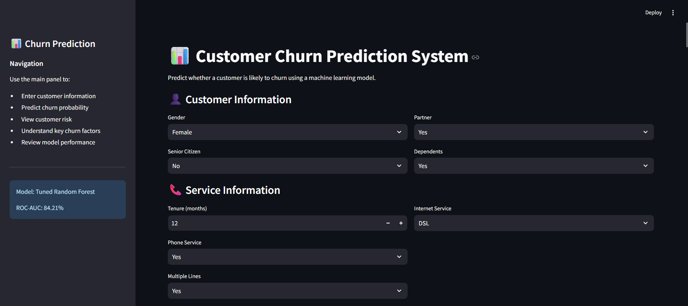
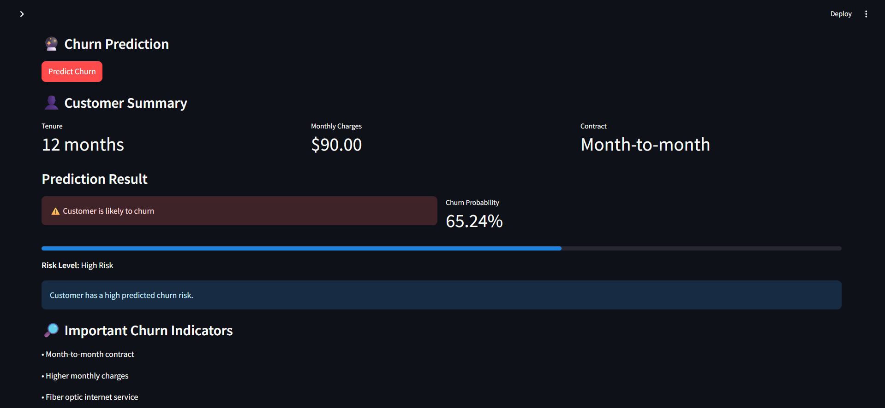
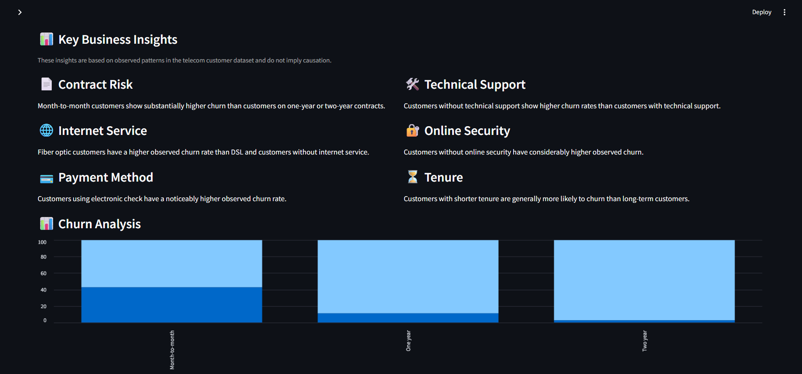

# 📊 Customer Churn Prediction System

An end-to-end machine learning application that predicts whether a telecom customer is likely to churn and provides actionable customer-risk insights through an interactive Streamlit dashboard.

## 🌐 Live Demo

Try the deployed application here:

[🚀 Customer Churn Prediction System](https://arulal04-customer-churn-prediction-app-t5olbb.streamlit.app/)

## 🚀 Project Overview

Customer churn is a major challenge for telecom companies because retaining an existing customer is often more valuable than acquiring a new one.

This project uses customer demographic, service, contract, and billing information to:

* Analyze customer churn patterns
* Identify important factors associated with churn
* Train and compare multiple machine learning models
* Tune the models using cross-validation
* Predict customer churn probability
* Classify customers according to their churn risk
* Provide business-oriented retention recommendations
* Deploy the trained model through an interactive Streamlit application

---

## 🎯 Business Problem

The objective is to predict whether a customer will leave the telecom service.

The system can help a business:

* Identify high-risk customers
* Prioritize retention campaigns
* Understand major churn patterns
* Monitor customers with moderate churn risk
* Make data-driven customer retention decisions

---

## 🛠️ Technologies Used

| Technology   | Purpose                                |
| ------------ | -------------------------------------- |
| Python       | Core programming language              |
| Pandas       | Data manipulation and analysis         |
| NumPy        | Numerical computation                  |
| Scikit-learn | Preprocessing, modeling and evaluation |
| XGBoost      | Gradient boosting model                |
| Matplotlib   | Data visualization                     |
| Seaborn      | Statistical visualization              |
| Streamlit    | Interactive web application            |
| Joblib       | Model serialization                    |
| Git          | Version control                        |
| GitHub       | Project hosting                        |

---

## 📂 Dataset

The project uses telecom customer data containing **7,043 customer records and 21 columns**.

The dataset includes:

### Customer Information

* Gender
* Senior Citizen
* Partner
* Dependents
* Tenure

### Services

* Phone Service
* Multiple Lines
* Internet Service
* Online Security
* Online Backup
* Device Protection
* Tech Support
* Streaming TV
* Streaming Movies

### Contract & Billing

* Contract
* Paperless Billing
* Payment Method
* Monthly Charges
* Total Charges

### Target

* Churn

---

## 🔍 Data Preprocessing

The following preprocessing steps were performed:

* Checked dataset dimensions and data types
* Checked missing values
* Checked duplicate records
* Converted `TotalCharges` to a numerical data type
* Investigated customers with zero tenure
* Separated numerical and categorical features
* Encoded categorical variables using One-Hot Encoding
* Standardized numerical variables using `StandardScaler`
* Split the dataset into training and testing sets using stratified sampling

### Dataset Split

```text
Total records     : 7,043
Training records  : 5,634
Testing records   : 1,409
```

The target distribution was preserved between training and testing data.

---

## 📊 Exploratory Data Analysis

Several important churn patterns were identified during EDA.

### Contract Type

Month-to-month customers had a substantially higher churn rate:

| Contract       | Churn Rate |
| -------------- | ---------: |
| Month-to-month |     42.71% |
| One year       |     11.27% |
| Two year       |      2.83% |

This indicates a strong relationship between contract commitment and churn.

### Tenure

Customers who churned had considerably shorter tenure.

```text
Mean tenure

No Churn : 37.57 months
Churn    : 17.98 months
```

The median values were:

```text
No Churn : 38 months
Churn    : 10 months
```

### Monthly Charges

Customers who churned generally had higher monthly charges.

```text
Median Monthly Charges

No Churn : 64.43
Churn    : 79.65
```

### Internet Service

Fiber optic customers showed a relatively high churn rate:

| Internet Service | Churn Rate |
| ---------------- | ---------: |
| DSL              |     18.96% |
| Fiber optic      |     41.89% |
| No Internet      |      7.40% |

### Payment Method

Electronic check customers showed the highest churn rate among the payment methods analyzed:

```text
Electronic check → 45.29%
```

### Technical Support

Customers without technical support had substantially higher churn:

```text
Without Tech Support → 41.64%
With Tech Support    → 15.17%
```

### Online Security

Customers without online security also showed substantially higher churn:

```text
Without Online Security → 41.77%
With Online Security    → 14.61%
```

> These findings represent observed patterns in the dataset and should not be interpreted as proof of causation.

---

## 🤖 Machine Learning Models

Three machine learning algorithms were trained and compared:

1. Logistic Regression
2. Random Forest
3. XGBoost

The models were evaluated using:

* Accuracy
* Precision
* Recall
* F1-score
* ROC-AUC

Because churn is the minority class, particular attention was given to **Recall, F1-score and ROC-AUC**, rather than relying only on accuracy.

---

## ⚙️ Hyperparameter Tuning

Hyperparameter optimization was performed using `RandomizedSearchCV` with 5-fold cross-validation.

### Logistic Regression

Best parameters:

```text
C = 100
class_weight = None
```

Cross-validation ROC-AUC:

```text
0.84598
```

### Random Forest

Best parameters:

```text
n_estimators      = 200
max_depth         = 8
min_samples_split = 5
min_samples_leaf  = 2
max_features      = sqrt
class_weight      = balanced
```

Cross-validation ROC-AUC:

```text
0.84768
```

### XGBoost

Best parameters:

```text
subsample         = 0.8
n_estimators      = 100
min_child_weight  = 5
max_depth         = 3
learning_rate     = 0.05
colsample_bytree  = 0.8
```

Cross-validation ROC-AUC:

```text
0.84947
```

---

## 🏆 Model Comparison

| Model                     |   Accuracy |  Precision |     Recall |   F1-score |    ROC-AUC |
| ------------------------- | ---------: | ---------: | ---------: | ---------: | ---------: |
| Logistic Regression       |     80.55% |     65.72% |     55.88% |     60.40% |     84.21% |
| Random Forest             |     78.28% |     61.89% |     47.33% |     53.64% |     82.32% |
| XGBoost                   |     80.55% |     67.01% |     52.67% |     58.98% |     84.38% |
| Tuned Logistic Regression |     79.99% |     64.38% |     55.08% |     59.37% |     84.09% |
| **Tuned Random Forest**   | **75.94%** | **53.23%** | **77.01%** | **62.95%** | **84.21%** |
| Tuned XGBoost             |     80.55% | **67.24%** |     52.14% |     58.73% | **84.78%** |

---

## 🏅 Final Model

The **Tuned Random Forest** was selected as the final deployment model.

The selection was based primarily on its strong:

* Recall
* F1-score
* Churn detection capability

Final test performance:

```text
Accuracy  : 75.94%
Precision : 53.23%
Recall    : 77.01%
F1-score  : 62.95%
ROC-AUC   : 84.21%
```

The model achieved a **77.01% recall**, meaning it identified a large proportion of the actual churn cases in the test set.

This makes it particularly useful for a retention-focused business scenario where missing potential churners can be costly.

---

## 🔎 Feature Importance

The final Random Forest identified the following features as highly important:

| Feature                           | Importance |
| --------------------------------- | ---------: |
| Contract — Month-to-month         |     0.1379 |
| Tenure                            |     0.1270 |
| Total Charges                     |     0.0875 |
| Contract — Two year               |     0.0754 |
| Online Security — No              |     0.0733 |
| Tech Support — No                 |     0.0605 |
| Monthly Charges                   |     0.0589 |
| Internet Service — Fiber optic    |     0.0558 |
| Payment Method — Electronic check |     0.0377 |
| Internet Service — DSL            |     0.0205 |

These features contribute strongly to the Random Forest's predictive decisions. Feature importance should not be interpreted as causal evidence.

---

## 🔧 Machine Learning Pipeline

The final model was implemented as a single Scikit-learn pipeline:

```text
Raw Customer Data
       ↓
ColumnTransformer
       ↓
 ┌───────────────┬──────────────────┐
 │ Numerical     │ Categorical      │
 │ Features      │ Features         │
 │               │                  │
 │ StandardScaler│ OneHotEncoder    │
 └───────────────┴──────────────────┘
       ↓
Tuned Random Forest
       ↓
Churn Prediction
       ↓
Churn Probability
```

Using a single pipeline ensures that the same preprocessing used during training is automatically applied during prediction.

---

## 🌐 Streamlit Application

The trained pipeline is integrated into an interactive Streamlit dashboard.

### 📸 Application Preview

#### Customer Dashboard



#### Churn Prediction



#### Business Insights



### 📁 Batch CSV Prediction

The application also supports batch churn prediction through CSV uploads.

Users can:

- Upload a customer CSV file
- Validate required customer features
- Automatically handle invalid numerical values
- Generate churn predictions for multiple customers
- Calculate churn probabilities
- Classify customers into Low, Medium, and High Risk
- View churn and risk-distribution charts
- Identify high-risk customers
- Download complete prediction results
- Download only high-risk customers
- Download a CSV template for new predictions

### Batch Prediction Workflow

```text
CSV Upload
    ↓
Column Validation
    ↓
Data Cleaning
    ↓
ML Pipeline
    ↓
Churn Prediction
    ↓
Churn Probability
    ↓
Risk Classification
    ↓
Business Summary
    ↓
High-Risk Customer List
    ↓
Download Results

The application allows users to enter:

* Customer demographics
* Tenure
* Service information
* Security and support services
* Streaming services
* Contract details
* Billing information

The application then provides:

### Prediction

```text
Likely to churn
or
Unlikely to churn
```

### Churn Probability

The model provides an estimated probability of churn.

### Risk Level

```text
Low Risk       → 0%–29%
Medium Risk    → 30%–59%
High Risk      → 60%–100%
```

### Business Recommendation

The dashboard provides a suggested action based on the predicted risk level.

### Business Insights

The dashboard also contains interactive churn analysis for:

* Contract
* Internet Service
* Payment Method
* Tech Support
* Online Security

---

## 📁 Project Structure

```text
customer-churn-prediction/
│
├── app.py
│
├── data/
│   └── telco_churn.csv
│
├── models/
│   └── churn_prediction_pipeline.pkl
│
├── note_books/
│   └── churn_analysis.ipynb
│
├── requirements.txt
├── .gitignore
└── README.md
```

---

## ⚙️ Installation

Clone the repository:

```bash
git clone https://github.com/Arulal04/customer-churn-prediction.git
```

Navigate into the project:

```bash
cd customer-churn-prediction
```

Install the required dependencies:

```bash
pip install -r requirements.txt
```

---


```markdown
## ▶️ Run the Streamlit Application

Run the application using:

```bash
python -m streamlit run app.py
```

The application will open in your default web browser.

📁 Using Batch CSV Prediction

The application supports batch prediction for multiple customers.

Open the Batch CSV Prediction section.
Download the CSV Template if you are using your own customer data.
Fill in the required customer information.
Upload the CSV file.
Click Predict Churn for All Customers.
Review the prediction summary and charts.
View the High-Risk Customers list.
Download the complete prediction results or the high-risk customer list.

## 💡 Business Recommendations

Based on the observed dataset patterns and model analysis, businesses could consider:

* Encouraging customers to move from month-to-month contracts to longer-term contracts
* Monitoring customers with short tenure
* Investigating high-risk customers with high monthly charges
* Reviewing the experience of fiber optic customers
* Monitoring customers using electronic check payments
* Improving access to technical support and online security services
* Prioritizing high-risk customers for retention campaigns

These recommendations are based on predictive patterns and should be validated through business experimentation before implementation.

---

## 🔮 Future Improvements

Potential improvements include:

* Threshold optimization based on business costs
* Advanced SHAP-based customer-level explanations
* Automated retention recommendations
* Model monitoring and drift detection
* Deployment using Streamlit Community Cloud
* Cloud-based model serving
* Customer segmentation
* Automated retraining pipeline

---

## 👨‍💻 Author

**Arulal Senapati**

GitHub:
https://github.com/Arulal04

---

## ⭐ Project Highlights

```text
7,043 customer records
19 predictive features
3 ML algorithms
Hyperparameter tuning
5-fold cross-validation
ROC-AUC based evaluation
F1-score based comparison
End-to-end Scikit-learn pipeline
Feature importance analysis
Interactive Streamlit dashboard
Git + GitHub version control
Batch CSV prediction
Customer risk classification
High-risk customer identification
Downloadable prediction results
Model explainability
Responsible-use documentation
```
